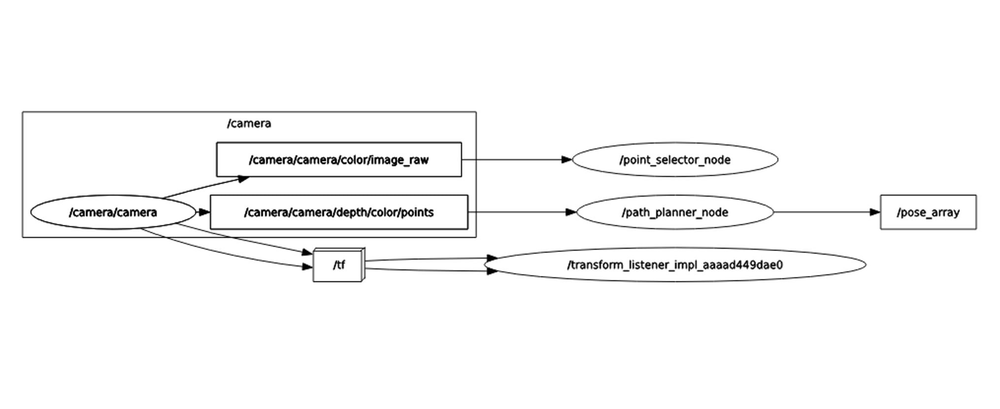
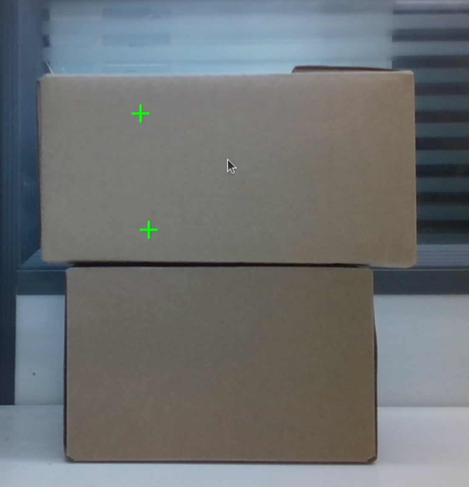
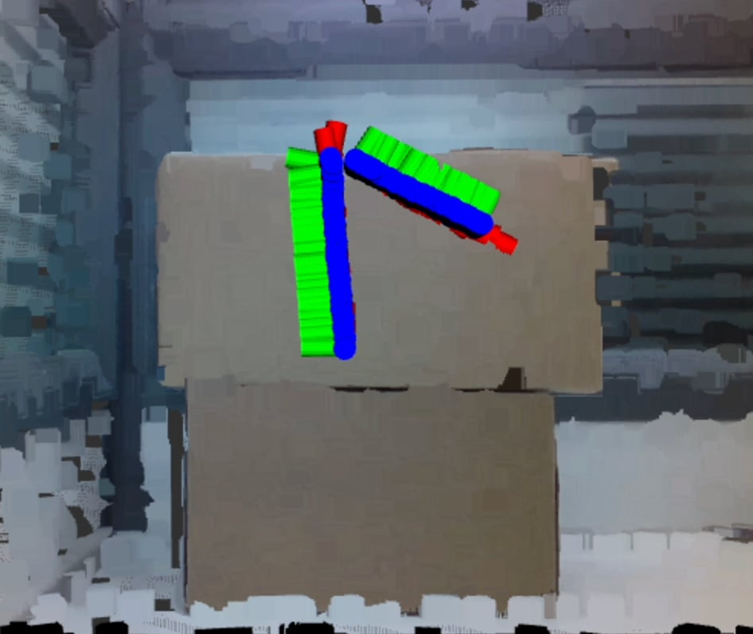

# Welding Path Planner

The Welding Path Planner is a ROS 2 Humble system, where the point_selector_node recieves multiple 2D pixel coordinates of a color image via 
mouse-clicks on an OpenCV GUI, and triggers a service request to the path_planner_node server, that plans a 3D path between the 2D pixel 
coordinates and publishes the pose array of this 3D path.

#### Features:
1. 2D Pixel Coordinate Input: The point_selector_node utilises OpenCV to register mouse-clicks of 2D pixel coordinates and triggers a path
						planning service request when the num_clicked_points is reached.
2. Plans a 2D Path between clicked points: The path_planner_node plans a linear 2D path between the clicked 2D pixel coordinates 
											(in order of click).
3. Projects this 2D Path to 3D Path: Using the Point Cloud, the path_planner node projects this 2D path to 3D (in the camera_depth_optical_frame).
4. Filters 3D Path: Replaces invalid (0, 0, 0) points from the 3D Path by searching neighbouring pixels that have a valid 3D projection.
5. Detects Invalid Path: Checks the Filtered 3D Path to see if any points exceed the configurable point_jump_threshold.
6. Generate and publish PoseArray: Computes the pose of each point in the Filtered 3D Path and publishes this PoseArray for viewing in Rviz2.

## Content
### Understanding the System
The 'rqt_graph' is a graphical visualisation tool in ROS2 that displays the communication between nodes, topics, services and actions.

To visualize the system, first launch the palletization vision server (refer to the section below). In a separate terminal, run:
```bash
ros2 run rqt_graph rqt_graph
```
This will generate a graph showing the connections between nodes and topics.

#### Identifying Publishers & Subscribers:
Nodes that publish to a topic are connected with arrows pointing out.
Nodes that subscribe to a topic have arrows pointing in.

If the graph does not update, click the refresh button in the top-left corner.

#### Debugging Missing Connections:
If a connection is not visible:

1. Check if the topic exists. Run: 
```bash
ros2 topic list
```

2. Inspect the publishers and subscribers to the node. Run: 
```bash
ros2 topic info /topic_name
```

3. Verify if data is being transmitted:
```bash
ros2 topic echo /topic_name
```

#### `rqt_graph` for system



### Visualisation

The PoseArray published by the path_planner node is best visualised in Rviz. In order to best visualise this path, first launch RViz after
launching the full system(see below):
Launch Rviz in a new terminal. Run:
```bash
rviz2
```

Within the RViz2 window, follow these steps:

1. Set the fixed frame:
   - In the Displays Panel, go to Global Options → Fixed Frame
   - Set it to: `camera_depth_optical_frame`

2. Add a PoseArray display:
   - Click Add in the Displays Panel and choose PoseArray
   - Set the following configurations:
     - Topic: `/pose_array`
     - Reliability Policy: Best Effort
     - Durability Policy: Volatile
     - Shape: Axis
     - Axes Length: `0.02`

3. Add a PointCloud2 display:
   - Click Add and choose PointCloud2
   - Set the following configurations:
     - Topic: `/camera/camera/depth/color/points`
     - Reliability Policy: Best Effort
     - Durability Policy: Volatile
     - Position Transformer: XYZ
     - Color Transformer: RGB8

After the path_planner node publishes a /pose_array, the path will be visualised in Rviz.

## Installation
The following steps assume that ROS 2 Humble has been installed. If not, please follow the official installation guide [here](https://docs.ros.org/en/humble/Installation/Ubuntu-Install-Debs.html).

### Install System Dependencies

Install ROS 2 dependencies:
```bash
sudo apt update
sudo apt install \
  ros-humble-rclpy \
  ros-humble-sensor-msgs \
  ros-humble-geometry-msgs \
  ros-humble-std-msgs \
  ros-humble-cv-bridge \
  ros-humble-tf-transformations
```

Install Python Packages:
```bash
pip install numpy opencv-python scikit-image
```

### Clone the Repository
Navigate to your ROS 2 workspace and Clone this repository.

## Usage
Ensure the camera is properly connected to the computer or host device.
If in a virtual machine, navigate to the Device tab and ensure the VM is allowed USB passthrough for the camera.
Next, Run:
```bash
realsense-viewer
rs-enumerate-devices
```
Confirm that the camera is functioning and is being enumerated correctly.
Ensure that the port and cable being used is USB 3.0.

### Launch
1. Open a new terminal and Build and Source your workspace. 
```bash
colcon build
source install/setup.bash
```

2. Run the following launch command to launch the system:
```bash
ros2 launch path_planner full_system_launch.py
```
This launch file initialises the full 3-node system required for 3D path planning using a RealSense camera. Specifically, it:

   * Launches the realsense2_camera node, loading camera configuration from realsense_config.yaml
   * Launches the Point Selector node, loading parameters from point_selector_param.yaml
   * Launches the Path Planner node, loading parameters from path_planner_params.yaml

Each node is launched using its own nested launch file stored in the launch/ directory, and all configuration files are stored in the config/ directory of the path_planner package.

3. Open Rviz to visualise path (refer to Visualisation section above).

### Mouse-click 2D points
4. The launch file will launch an OpenCV window displaying the 2D color image. Mouse-click'ing will produce a green cross on the pixel coordinate that was pressed, as well as logging the 2D coordinate clicked in the terminal (example shown below).

```bash
[point_selector-2] [INFO] [1752823315.447398860] [point_selector_node]: User clicked at pixel (694, 257)
[point_selector-2] [INFO] [1752823322.884541434] [point_selector_node]: User clicked at pixel (668, 360)
[point_selector-2] [INFO] [1752823324.851015667] [point_selector_node]: User clicked at pixel (801, 325)
[point_selector-2] [INFO] [1752823324.851207042] [point_selector_node]: Number of clicks required has been reached. 
[point_selector-2] Requesting Path Planning.
```



5. When 'num_clicked_points' is reached, this will automatically trigger a service request to the path_planner_node to plan a 3D path interpolating said points.

6. The path_planner node logs messages (at the info, debug, and error level) indicating the computation of paths and detection of invalid paths.The path_planner node then publishes a PoseArray of the path on the /pose_array topic which can be visualised in RViz:



7. The service returns the following interface of response to the point_selector_node below. The custom service and message interfaces produced for this system can be found in /welding_path_interfaces.

```bash
bool success # Return True if a 3D path interpolating the clicked points has been planned.
string message # Info regarding the number of Pose' in the 3D path planned.
geometry_msgs/PoseArray pose_array # The PoseArray of the 3D path.

```

### Adjusting the parameters
Under the '/path_planner/config' there are the following .yaml files:

   * path_planner_params.yaml: set parameters for the path_planner_node.
   * point_selector_params.yaml: set parameters for the point_selector_node.
   * realsense_config.yaml: set parameters for the realsense2_camera node.

The realsense_config.yaml sets parameters for the realsense2_camera node to publish /camera/camera/color/image_raw and /camera/camera/depth/color/points for us to be able to plan this 3D path.

point_selector_params.yaml descriptions:
```bash
num_clicked_points: The number of 2D pixel mouse clicks the user is expected to input. A linear path will be interpolated between these clicked points.
```

path_planner_params.yaml descriptions:
```bash
num_interpolated_points: Number of interpolated 2D points used when planning the linear path through all of the clicked points.
point_jump_threshold: The maximum allowable euclidean distance, in metres, between two adjacent 3D points in the path. If the distance between any two adjacent points exceeds this, the path is to be considered invalid.
```

## Acknowledgement
Jasdeep Renny for providing the code in this repository.

## Contact 
Jasdeep Renny:
[jasrenny@hotmail.com](mailto:jasrenny@hotmail.com)